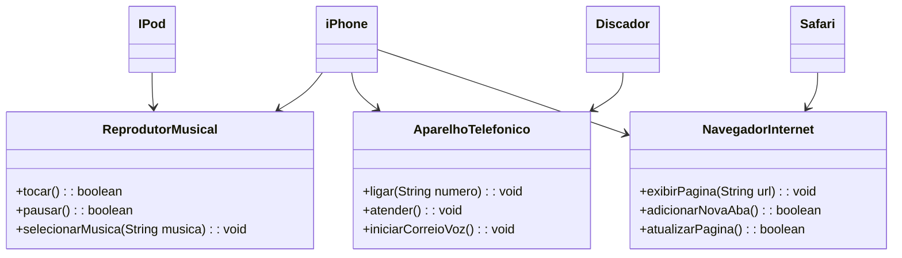

```mermaid
classDiagram
class ReprodutorMusical {
+tocar() : boolean
+pausar() : boolean
+selecionarMusica(String musica) : void
}

    class AparelhoTelefonico {
        +ligar(String numero) : void
        +atender() : void
        +iniciarCorreioVoz() : void
    }

    class NavegadorInternet {
        +exibirPagina(String url) : void
        +adicionarNovaAba() : boolean
        +atualizarPagina() : boolean
    }

    class iPhone {
    }

    iPhone --> ReprodutorMusical 
    iPhone --> AparelhoTelefonico 
    iPhone --> NavegadorInternet

    IPod --> ReprodutorMusical
    Discador --> AparelhoTelefonico
    Safari --> NavegadorInternet
     

```
